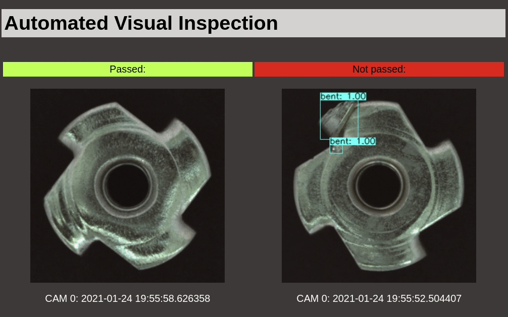

# [Manuela](https://github.com/sa-mw-dach/manuela) Showcase: Visual Inspection on OpenShift

Demo Use cases:
- Computer vision object detection for spotting anomalies
- ML model training with GPUs using OpenShift Kubernetes jobs
- [Annotate images with CVAT running on OpenShift Virtualization](docs/cvat-cnv.md)
- Benefits of OpenShift Serverless (knative) for messaging and ML model inferencing


# Installation on OpenShift Kubernetes
This section describes the installation of the runtime on OpenShift. The model training is described in [ml/README.md](ml/README.md).

## Prerequisites
- Red Hat OpenShift Serverless Operator is installed (knative)
- Red Hat Integration - AMQ Streams Operator is installed (kafka)
- Clone this repo into your home directory

## Create namespace

Create the namespace/project via CLI because the yaml contains the required `eventing.knative.dev/injection: enabled` label.

```
oc apply -f manifests/namespace.yaml
oc project manuela-visual-inspection
```

## Create a kafka cluster and topic

```
oc apply -f manifests/kafka-cluster.yaml
```
Wait until the cluster is up and running.

Create a topic for the images:

```
oc apply -f manifests/kafka-topic-vs.yaml 
```


## Build and deploy the Camera simulator

The camera simulator (cam-sim) sends images into the backend via a kafka topic.

Build and deploy:

```
oc apply -k cam/manifests
```

Check that pod is running and submiting images:

```
oc logs -l app=cam-sim
...
client.py (INFO): Imagae 36: {'label': 'good', 'path': 'data/metal_nut/good/178.png'}
client.py (INFO): Message sent: visual-inspection-images - 2021-01-24 18:48:45.479030 - (350, 350, 3)
client.py (INFO): Imagae 37: {'label': 'scratch', 'path': 'data/metal_nut/scratch/020.png'}
...
```

## Build and deploy the images-processor

The images-processor is implemented as knative service. It processes the submitted images and detects anomalies.


Build and deploy:

```
oc apply -k image-processor/manifests
```

Follow the build logs:
```
oc logs bc/image-processor -f
```

Check the log of the image-processor knative service

```
oc logs -l serving.knative.dev/service=image-processor -c image-processor -f
...
[2021-01-24 19:18:14,863] INFO in image-processor: 2021-01-24 19:18:14.818647 (350, 350, 3)
[2021-01-24 19:18:15,110] INFO in image-processor: Predict: Total object detection took 0.24715 seconds
[2021-01-24 19:18:15,110] INFO in image-processor: ['scratch', 'scratch']
...

```


## Build and deploy the dashboard

The dashboard shows the incoming images and highlights the anomalies with colored bounding boxes.
The dashboard is implemented as knative service


Build and deploy:

```
oc apply -k dashboard/manifests
```

Follow the build logs:
```
oc logs bc/dashboard -f
```


Check the log of the dashboard knative service

```
oc logs -l serving.knative.dev/service=dashboard -c dashboard -f
...
emitting event "server2ui2" to all [/ui2]
emitting event "server2ui2" to all [/ui2]
...

```

Get the URL of the dashboard:
```
oc get routes.serving.knative.dev dashboard

NAME        URL                                                                                  READY   REASON
dashboard   http://dashboard-manuela-visual-inspection.apps.ocp5.stormshift.coe.muc.redhat.com   True    
```

**View the dashboard:**



*ATTRIBUTION: Paul Bergmann, Michael Fauser, David Sattlegger, Carsten Steger. [MVTec AD](https://www.mvtec.com/company/research/datasets/mvtec-ad) - A Comprehensive Real-World Dataset for Unsupervised Anomaly Detection; in: IEEE Conference on Computer Vision and Pattern Recognition (CVPR), June 2019*


# Demo flow
TBD

# Local 'on laptop' deployment
TBD