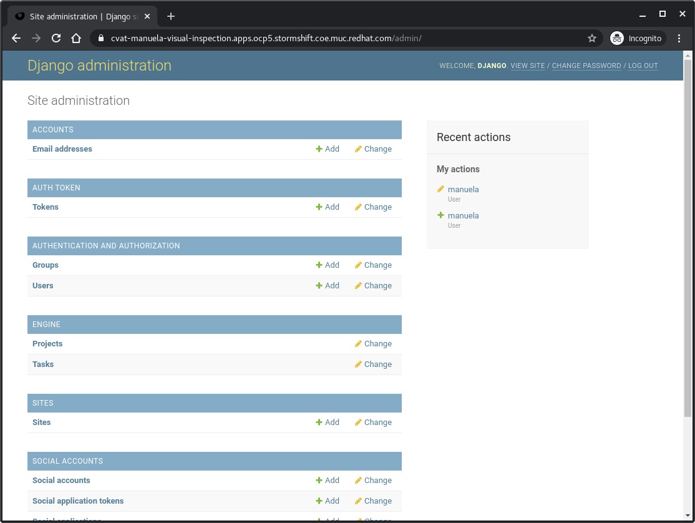
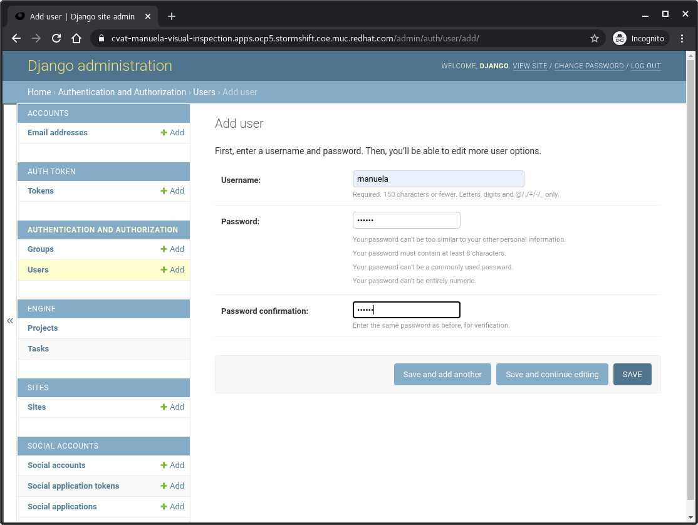
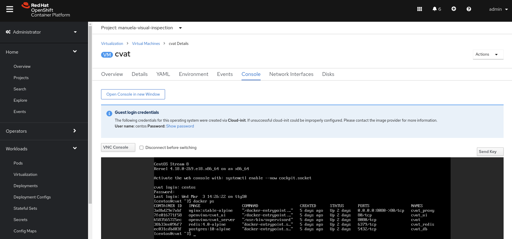
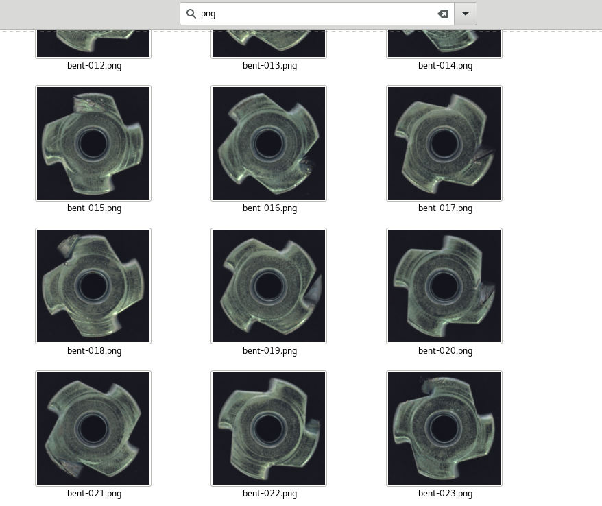
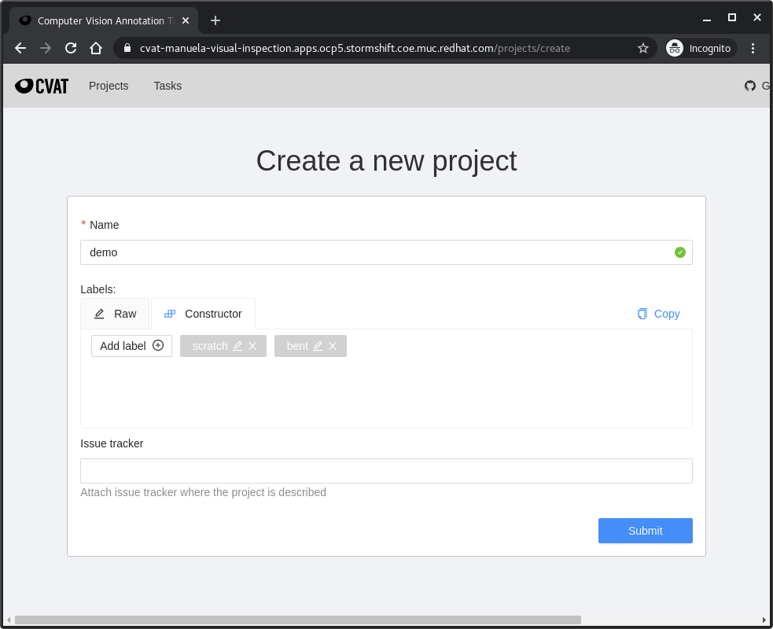
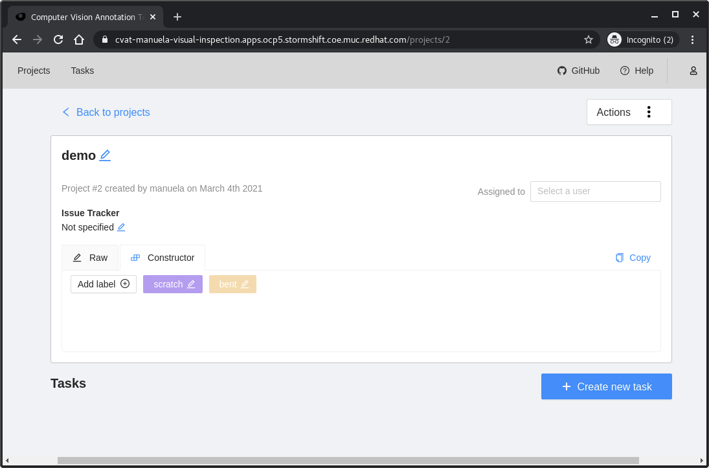
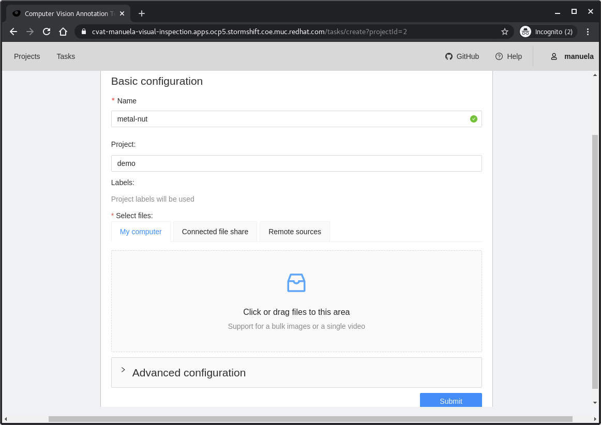
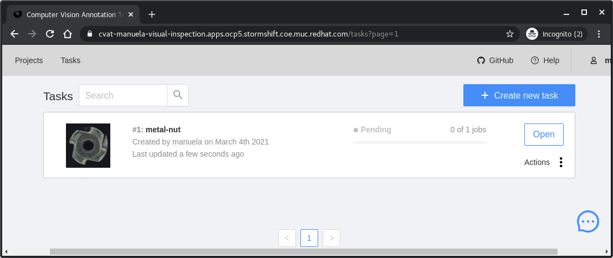
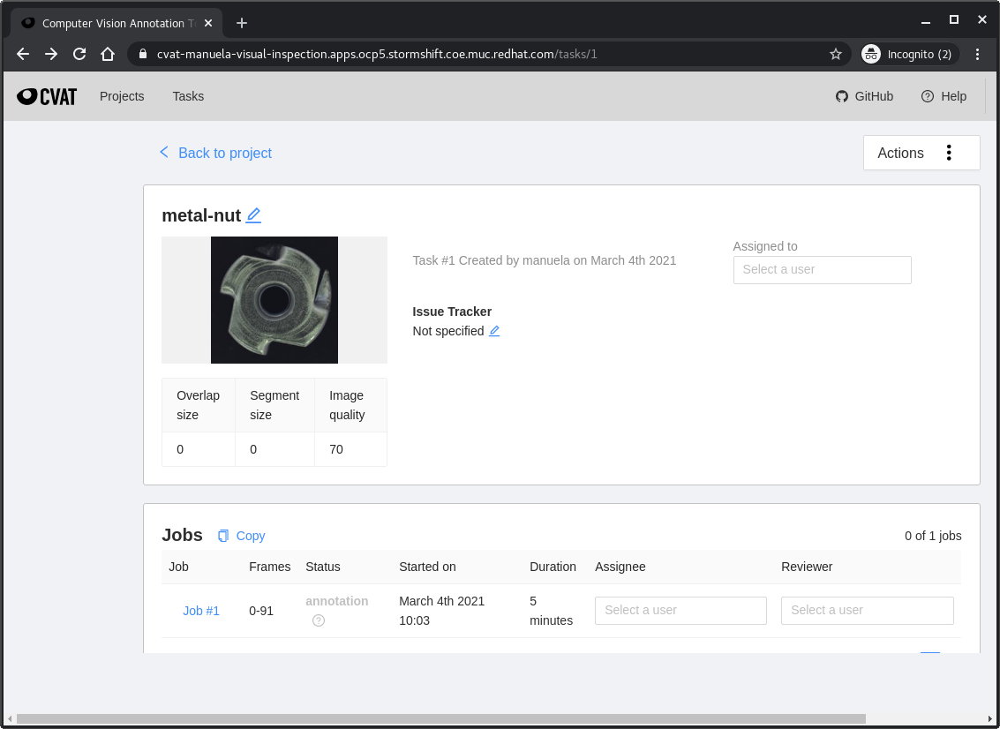
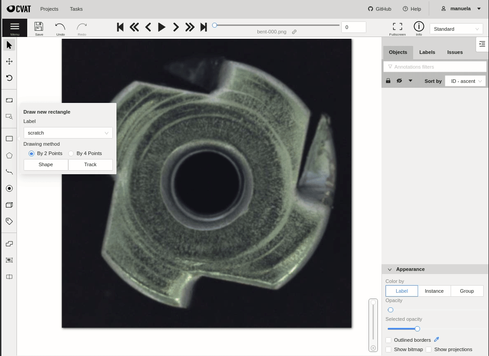

# Deploy and demo CVAT on OpenShift Virtualization <!-- omit in toc -->
This document describes how to deploy and demonstrate [CVAT](https://github.com/openvinotoolkit/cvat) on OpenShift Virtualization

- [Prerequisites](#prerequisites)
- [Install CVAT in a OpenShift Virtualization virtual machine](#install-cvat-in-a-openshift-virtualization-virtual-machine)
  - [Install CentOS Steams VM](#install-centos-steams-vm)
  - [Install CVAT](#install-cvat)
  - [Add User in CVAT](#add-user-in-cvat)
- [Image labeling with the Computer Vision Annotation Tool](#image-labeling-with-the-computer-vision-annotation-tool)
  - [Show Docker application running in OpenShift Virtualization VM](#show-docker-application-running-in-openshift-virtualization-vm)
  - [Demo the annotation workflow for the visual inspecting showcase](#demo-the-annotation-workflow-for-the-visual-inspecting-showcase)
- [Demo Clean-up](#demo-clean-up)


## Prerequisites

- OpenShift Virtualization is deployed and configured on you target cluster
- `virtctl` on your laptop (install demo only)
- Project `manuela-visual-inspection` has been created.

## Install CVAT in a OpenShift Virtualization virtual machine

### Install CentOS Steams VM

In the OpenShift Console go into the `manuela-visual-inspection` project and navigate to `Virtualization` -> `VirtualMachines`.
- Select `Create` -> `From catalog` -> `CentOS Stream 8 VM` -> `Customize VirtualMachine`
- Enter General data:
  - Name: cvat
  - Optional parameter `CLOUD_USER_PASSWORD`: `redhat`
- Review and Create Virtual Machine
- Start Virtual Machine
- Check the Console and login

### Install CVAT

The steps below are based on [CVAT Quick installation guide](https://github.com/openvinotoolkit/cvat/blob/develop/cvat/apps/documentation/installation.md#quick-installation-guide)

**Login into the CentOS Streams VM, install and start tmux**
```
# oc get vmi
NAME   AGE   PHASE     IP             NODENAME
cvat   13d   Running   10.131.0.109   storm5-10g.ocp5.stormshift.coe.muc.redhat.com

# virtctl console cvat
Successfully connected to cvat console. The escape sequence is ^]

[centos@cvat ~]$ sudo dnf install tmux -y
[centos@cvat ~]$ tmux
```


**Install Docker and Compose**
```
# sudo systemctl disable firewalld
# sudo dnf install iptables -y

# sudo dnf config-manager --add-repo=https://download.docker.com/linux/centos/docker-ce.repo
# sudo  dnf install docker-ce --nobest -y
# sudo systemctl enable --now docker

# systemctl is-active docker
active
# systemctl is-enabled docker
enabled

# sudo docker --version
Docker version 20.10.3, build 48d30b5
```

**Enable `centos` user**
```
# sudo usermod -aG docker centos
```
Log out and log back in (or reboot) so that your group membership is re-evaluated. 


Test Docker
```
# docker run hello-world
```

**Install Compose**
```
# curl -L https://github.com/docker/compose/releases/download/1.25.4/docker-compose-`uname -s`-`uname -m` -o docker-compose
# sudo mv docker-compose /usr/local/bin && sudo chmod +x /usr/local/bin/docker-compose
```


**Install CVAT via compose**
```
# sudo dnf install git -y
# git clone https://github.com/opencv/cvat
# cd cvat
# git checkout tags/v1.4.0
# vim docker-compose.yml
```
Add the proper image tags to the CVAT containers:
```
...
cvat:
  container_name: cvat
  image: openvino/cvat_server:v1.4.0
...
cvat_ui:
  container_name: cvat_ui
  image: openvino/cvat_ui:v1.4.0
...
```
Then spin up the containers:
```
# docker-compose up -d
```

**Create superuser**

I.e. django / password
```
# docker exec -it cvat bash -ic 'python3 ~/manage.py createsuperuser'
Username (leave blank to use 'django'): 
Email address: 
Password: password
Password (again): password
This password is too common.
Bypass password validation and create user anyway? [y/N]: y
Superuser created successfully.

```

**Check container**
```
# docker ps
CONTAINER ID   IMAGE                  COMMAND                  CREATED         STATUS         PORTS                  NAMES
8301ab32e473   nginx:stable-alpine    "/docker-entrypoint.…"   7 minutes ago   Up 7 minutes   0.0.0.0:8080->80/tcp   cvat_proxy
4ba51027a506   openvino/cvat_ui       "/docker-entrypoint.…"   7 minutes ago   Up 7 minutes   80/tcp                 cvat_ui
accf8d79a21c   openvino/cvat_server   "/usr/bin/supervisord"   7 minutes ago   Up 7 minutes   8080/tcp               cvat
6d255df66037   redis:4.0-alpine       "docker-entrypoint.s…"   7 minutes ago   Up 7 minutes   6379/tcp               cvat_redis
20fc714a68e6   postgres:10-alpine     "docker-entrypoint.s…"   7 minutes ago   Up 7 minutes   5432/tcp               cvat_db
```

**Check if the CVAT web site is responding**
```
# curl localhost:8080
...
        <meta
            name="description"
            content="Computer Vision Annotation Tool (CVAT) is a free, open source, web-based image and video annotation tool which is used for labeling data for computer vision algorithms. CVAT supports the primary tasks of supervised machine learning: object detection, image classification, and image segmentation. CVAT allows users to annotate data for each of these cases"
        />
        <meta name="”robots”" content="index, follow" />
        <title>Computer Vision Annotation Tool</title>
...

```

**Expose VCAT externally**
```

Replace `.apps.ocp5.stormshift.coe.muc.redhat.com` with your `CVAT_HOST`
# docker-compose down

# cat <<EOF > docker-compose.override.yml 
version: '3.3'

services:
  cvat_proxy:
    environment:
      CVAT_HOST: .apps.ocp5.stormshift.coe.muc.redhat.com
EOF

# docker-compose up -d
```

**Exit VM shell**
```
exit
```

**Expose port as service and create route**

```
# virtctl expose virtualmachineinstance cvat --port=8080 --name=cvat
# oc create route edge --service=cvat

# oc get route cvat
NAME   HOST/PORT                                                                PATH   SERVICES   PORT    TERMINATION   WILDCARD
cvat   cvat-manuela-visual-inspection.apps.ocp5.stormshift.coe.muc.redhat.com          cvat       <all>   edge          None
```


### Add User in CVAT

Open your CVAT Django Admin page and add a user. E.g.,

https://cvat-manuela-visual-inspection.apps.ocp5.stormshift.coe.muc.redhat.com/admin/




Add User. E.g. manuela / cvatdemo


Add user to annotator, observer and user group


Save and logout.

For further details see the [CVAT Users Guide](https://github.com/openvinotoolkit/cvat/blob/develop/cvat/apps/documentation/user_guide.md#users-guide)


## Image labeling with the Computer Vision Annotation Tool

The demo has multiple parts and you can pick and choose depending on you audience.

1. Show Docker application running in OpenShift Virtualization VM
2. Demo the annotation workflow for the visual inspecting showcase


### Show Docker application running in OpenShift Virtualization VM
For a long demo, walk through the installation above. 
Alternatively, you can just open the console of the `cvat` virtual machine, login and show the running container with `docker ps`:  

 Additional, navigate to the routes and open the `cvat` route.

### Demo the annotation workflow for the visual inspecting showcase

**Show unlabeled images on file systems**

With your favorite file explorer, navigate to `manuela-visual-inspection/ml/darknet/data/metal_yolo` and filter for `png` files and explain the data: List of scratch bent and good images



**Upload and show images in CAVT**
- Open CVAT in E.g. https://cvat-manuela-visual-inspection.apps.ocp5.stormshift.coe.muc.redhat.com 
- Login as `manuela` user.
- Create a new project `demo` and add the labels `scratch` and `bent` to the project:

- Open the `demo` project and create a new task: 
- Name the task `metal-nut` and upload all `png` images from `manuela-visual-inspection/ml/darknet/data/metal_yolo/` using `Click or drag files to this area`: 
- Submit task. `The data are being uploaded to the server..`
- Navigate to `Tasks`: 

**Annotate**
Showcase manual annotation:
- Open `Job #1`: 
- Show how to annotate manually: 

Upload pre-labeled annotations:
- Navigate to the Task list and select `Actions` -> `Upload Annotations` -> `YOLO 1.1`
- Upload annotation file `metal-nut-annotations.zip` from `manuela-visual-inspection/ml/darknet/`.
- In case the warning `Current annotation will be lost` appears, press `Update`.

Show pre-labeled data:
- Open the `task` and `job`
- Show annotations 
- The dataset is ready to training!


## Demo Clean-up

**Clean-up annotation workflow**

- In CVAT, navigate to projects and delete `demo` project.

**Delete cvat VM**

- Delete VM, DV, Service and Route
```
oc project manuela-visual-inspection
oc delete vm cvat
oc delete dv centos8-stream
oc delete route cvat
oc delete service cvat
```