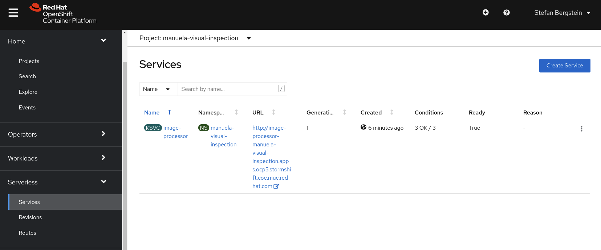
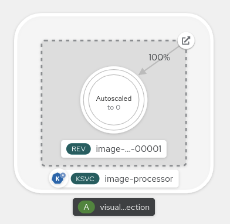
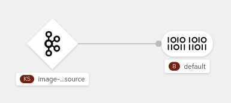
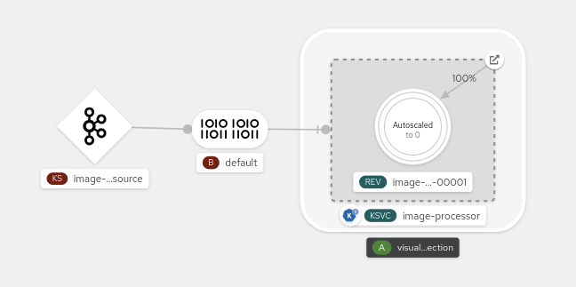
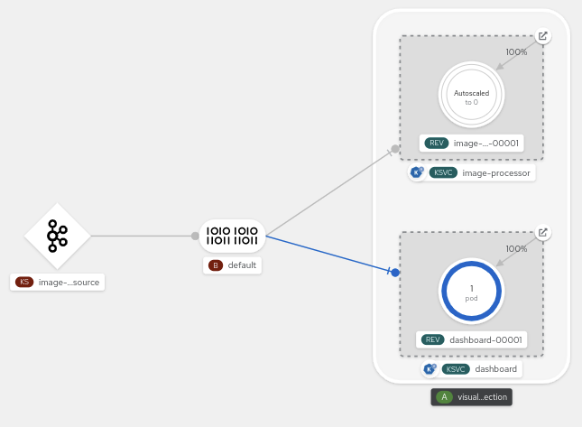
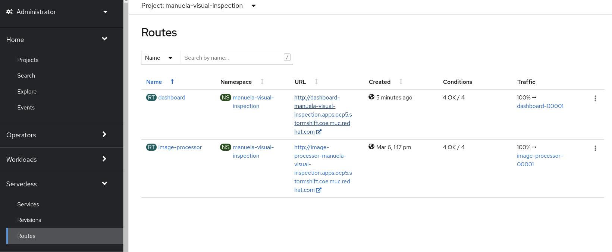
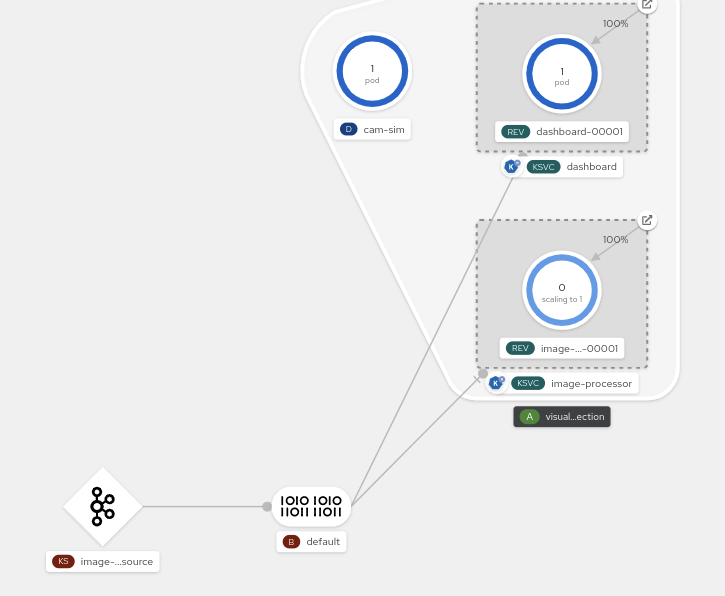

# Visual Inspection Runtime <!-- omit in toc -->

This section describes the installation of the runtime on OpenShift. The model training is described in [ml/README.md](../ml/README.md). And the image annotation is explained in [here](cvat-cnv.md).

- [Prerequisites](#prerequisites)
- [Installation](#installation)
  - [Create namespaces](#create-namespaces)
  - [Create a kafka cluster and topic](#create-a-kafka-cluster-and-topic)
  - [Build the Camera simulator](#build-the-camera-simulator)
  - [Build the images-processor](#build-the-images-processor)
  - [Build the dashboard](#build-the-dashboard)
- [Demo Execution](#demo-execution)
  - [Deploy the images-processor](#deploy-the-images-processor)
  - [Connect to kafka](#connect-to-kafka)
  - [Deploy the dashboard](#deploy-the-dashboard)
  - [Deploy the Camera simulator](#deploy-the-camera-simulator)
- [Visual Inspection ML inferencing demo](#visual-inspection-ml-inferencing-demo)
- [Demo Clean-up](#demo-clean-up)

## Prerequisites

- S3 compatible object storage such as OpenShift Data Foundation.
- Red Hat OpenShift Data Science (RHODS). (Please refer to this [ml/README.md](../ml/README.md) to set up an example environment)
- Red Hat OpenShift Serverless Operator is installed (knative)
- Red Hat Integration - AMQ Streams Operator is installed (kafka)
- This repo is cloned into your home directory
- Configured and tested RHODS model server with the visual inspection ML model

  The Visual Inspection Runtime requires the deployed ML model. Please ensure that model is deployed, by following the steps in [Model Serving](../ml/README.md#model-serving).
  Or, in case you prefer shortcuts, you can try the [CLI based setup of RHDOS for Manu-vi model serving](../ml/manifests/README.md)

## Installation

This installation section describes only the configuration of kafka and building the container images. The installation is finalized as part of the [Demo Execution](#demo-execution) in the following section.

If not already done, please clone this repository:

```
git clone https://github.com/stefan-bergstein/manuela-visual-inspection.git
cd manuela-visual-inspection
```

### Create namespaces

Create the namespace/project via the OpenShift CLI:

```
oc new-project manuela-visual-inspection
```

Or via the provided manifest:

```
oc apply -f manifests/namespace.yaml
```

Or via the OpenShift WebConsole.

In most cases, these are the common approaches to create resources in OpenShift. We will proceed with applying manifests from this repository. Feel free to take a look at these before applying to understand which resources are being created. A lot of these manifests can be self explanatory with the combination of the content of `kind` and `spec`.

### Create a kafka cluster and topic

Make sure the Red Hat Integration AMQ Streams operator is installed first via the OperatorHub.

Then create a kafka cluster and topic:

```
oc apply -f manifests/kafka/kafka.yaml
```

Wait until the cluster is up and running. E.g.:

```
oc get pods
NAME                                                   READY   STATUS    RESTARTS   AGE
amq-streams-cluster-operator-v1.7.0-67b4df466f-skc8r   1/1     Running   0          17m
manu-vi-entity-operator-84fbfbcc84-x5dnt               2/3     Running   0          97s
manu-vi-kafka-0                                        1/1     Running   0          2m12s
manu-vi-kafka-1                                        1/1     Running   0          2m12s
manu-vi-kafka-2                                        1/1     Running   0          2m12s
manu-vi-zookeeper-0                                    1/1     Running   0          3m14s
manu-vi-zookeeper-1                                    1/1     Running   0          3m14s
manu-vi-zookeeper-2                                    1/1     Running   0          3m14s

```

Create a topic for the images:

```
oc apply -f manifests/kafka/kafka-topic.yaml
```

### Set up Serverless

Make sure the Red Hat Serverless operator is installed first via the OperatorHub.

Instantiate `KnativeServing`:

```
oc apply -f manifests/serverless/knative-serving.yaml
```

Instantiate `KnativeEventing`:

```
oc apply -f manifests/serverless/knative-eventing.yaml
```

Instantiate `KnativeKafka`:

```
oc apply -f manifests/serverless/knative-kafka.yaml
```

### Build the Camera simulator

The camera simulator (cam-sim) sends images into the image processor backend via a kafka topic.

Start the build:

```
oc apply -f cam/manifests/cam-sim-bc.yaml
```

Watch the build ...

```
oc logs -f bc/cam-sim
..,
Successfully pushed image-registry.openshift-image-registry.svc:5000/manuela-visual-inspection/cam-sim@sha256:389766a7787cce83b0178eb537a9e16659cac5626da31485508d22cba083ca0a
Push successful
...
```

### Build the images-processor

The images-processor is implemented as knative service. It processes the submitted images and detects anomalies.

Start the build:

```
oc apply -f image-processor/manifests/image-processor-bc.yaml
```

Follow the build logs ..

```
oc logs bc/image-processor -f
...
Storing signatures
Successfully pushed image-registry.openshift-image-registry.svc:5000/manuela-visual-inspection/image-processor@sha256:1bf0c36cc522aa8f5ff1f7780d0b89adb8054b88a0cf6b0d8e10de41d8208321

```

### Build the dashboard

The dashboard shows the incoming images and highlights the anomalies with colored bounding boxes.
The dashboard is implemented as knative service.

Start the build:

```
oc apply -f dashboard/manifests/dashboard-bc.yaml
```

Follow the build logs:

```
oc logs bc/dashboard -f
...
Storing signatures
Successfully pushed image-registry.openshift-image-registry.svc:5000/...
Push successful
```

## Demo Execution

During the demo we are going to finalize the installation and explain each component of the serverless architecture.

### Deploy the images-processor

The images-processor is implemented as knative service. It processes the submitted images and detects anomalies.

First, edit `image-processor/manifests/image-processor-kn-svc.yaml` and update the inference endpoint:

```
...
data:
  INFER_URL: "https://<model-name>-<my-ods-project>.apps.<my-ocp-cluster>/v2/models/manu-vi/infer"
...
```

Deploy the knative service:

```
oc apply -f image-processor/manifests/image-processor-kn-svc.yaml
```

If applicable, explain the [image-processor-kn-svc.yaml](../image-processor/manifests/image-processor-kn-svc.yaml)

Show and explain the Serverless Services and Revisions in the OpenShift Admin Console:


After the initial startup, the service is scaled back to zero because the service does not receive any images yet. See the Developer Console:



### Connect to kafka

The images-processor does not need to deal with any kafka details. It just receives [Cloud-Events](https://cloudevents.io/) via a [broker and trigger](https://knative.dev/docs/eventing/#event-brokers-and-triggers).


The images-processor python snippet shows that it is agnostic to Kafka or any other event source:

```python
@app.route('/', methods=['POST'])
def process_image():
    # app.logger.debug(request.headers)

    # create a CloudEvent
    event = from_http(request.headers, request.get_data())

    # you can access cloudevent fields as seen below
    app.logger.info(
        f"Found {event['dashboardid']} from {event['source']} with type "
        f"{event['type']} and specversion {event['specversion']}"
    )
...
```

The Knative Service has been already created with the previous step

```
oc get ksvc image-processor

NAME              URL                                                                                        LATESTCREATED           LATESTREADY             READY   REASON
image-processor   http://image-processor-manuela-visual-inspection.apps.ocp5.stormshift.coe.muc.redhat.com   image-processor-00001   image-processor-00001   True
```

Let's define a default broker and a [Kafka-Source](../image-processor/manifests/image-processor-kafkasource.yaml) and set the sink to the default broker:

```
oc apply -f image-processor/manifests/image-processor-kafkasource.yaml
```

Check the topology in the Developer Console:



Now we just need to set the [trigger](../image-processor/manifests/image-processor-trigger.yaml) so that the service receives images as cloud events:

```
oc apply -f image-processor/manifests/image-processor-trigger.yaml
```

The broker is now connected to the image-processor knative service:


### Deploy the dashboard

The dashboard shows the incoming images and highlights the anomalies with colored bounding boxes.
The dashboard is implemented as knative service and receives cloud events, which are emitted by the image processor.

Deploy the dashboard [knative service](../dashboard/manifests/dashboard-kn-svc.yaml) and [trigger](../dashboard/manifests/dashboard-trigger.yaml):

```
oc apply -k dashboard/manifests
```

Show the developer console:


Open the Dashboard user via OpenShift Admin Console -> Serverless -> Routes:


Or get the URL of the dashboard via cli:

```
oc get routes.serving.knative.dev dashboard

NAME        URL                                                                                  READY   REASON
dashboard   http://dashboard-manuela-visual-inspection.apps.ocp5.stormshift.coe.muc.redhat.com   True
```

NOTE: Depending on your TLS configuration, ensure you're requesting the dashboard through HTTP and not HTTPS.

Click on the Dashboard URL and navigate to `Automated Visual Inspection`:

No images are displayed yet, because the camera simulator (cam-sim) is not running.

### Deploy the Camera simulator

The camera simulator (cam-sim) sends images into the backend via a kafka topic.

Deploy the simulator:

```
oc apply -f cam/manifests/cam-sim-depl.yaml
```

Check and show that pod is running and submitting images:

```
oc logs -l app=cam-sim
...
client.py (INFO): Imagae 36: {'label': 'good', 'path': 'data/metal_nut/good/178.png'}
client.py (INFO): Message sent: visual-inspection-images - 2021-01-24 18:48:45.479030 - (350, 350, 3)
client.py (INFO): Imagae 37: {'label': 'scratch', 'path': 'data/metal_nut/scratch/020.png'}
...
```

**image-processor is scaling**

The image-processor is receiving cloud events and i is starting.
Note, be patient. It takes some time to start the image-processor pod because it needs to initialize TensorFlow and load the model.



Check the logs of the image-processor:

```
oc logs -l serving.knative.dev/service=image-processor -c image-processor -f
```

Expected output

Once it is started you can see the log of the dashboard knative service

```
oc logs -l serving.knative.dev/service=dashboard -c dashboard -f
...
emitting event "server2ui2" to all [/ui2]
emitting event "server2ui2" to all [/ui2]
...

```

... or view the dashboard.

**View the dashboard:**


_ATTRIBUTION: Paul Bergmann, Michael Fauser, David Sattlegger, Carsten Steger. [MVTec AD](https://www.mvtec.com/company/research/datasets/mvtec-ad) - A Comprehensive Real-World Dataset for Unsupervised Anomaly Detection; in: IEEE Conference on Computer Vision and Pattern Recognition (CVPR), June 2019_

## Visual Inspection ML inferencing demo

It is not a lot to demo for the ML inferencing beside showing the dashboard and the logs. The image-processor knative service receives images from kafka, does the tensorflow based inferencing and emits a cloud event for the dashboard and action processor.

Beside viewing the dashboard with the bounding boxes for the anomalies, you can view the log of the images-processor:

```
oc logs -l serving.knative.dev/service=image-processor -c image-processor -f
...
[2021-03-06 20:08:55,959] INFO in image-processor: 2021-03-06 20:08:55.877409 (350, 350, 3)
[2021-03-06 20:08:56,298] INFO in image-processor: Predict: Total object detection took 0.33952 seconds
[2021-03-06 20:08:56,298] INFO in image-processor: ['scratch']
...
```

The `image-processor` receives cloud event that includes a images, calls the TensorFlow ML model, and predicts an anomaly (scratch or bent).

## Demo Clean-up

```
oc delete -f cam/manifests/cam-sim-depl.yaml
oc delete -k dashboard/manifests/
oc delete -k image-processor/manifests/
```

# Troubleshooting hints

## Kafka

Find Kafka Bootstrap server:

```
oc describe Kafka manu-vi -n manuela-visual-inspection
```

Expected example output:

```
...
    Bootstrap Servers:  manu-vi-kafka-bootstrap.manuela-visual-inspection.svc:9092
    Name:               plain
    Type:               plain
...
```

Double check that the bootstrap server is defined in the kafka-source:

```
oc describe KafkaSource image-processor-kafka-source
```

Expected example output:

```
...
Spec:
  Bootstrap Servers:
    manu-vi-kafka-bootstrap.manuela-visual-inspection.svc:9092
 ...
```

Check Topic:

```
oc exec manu-vi-kafka-0 -c kafka -n manuela-visual-inspection -- bin/kafka-topics.sh --list --bootstrap-server manu-vi-kafka-bootstrap.manuela-visual-inspection.svc:9092
```

Expected example output:

```
__consumer_offsets
__strimzi-topic-operator-kstreams-topic-store-changelog
__strimzi_store_topic
visual-inspection-images
```

Check that messages are arriving:

```
oc exec manu-vi-kafka-0 -c kafka -n manuela-visual-inspection -- bin/kafka-console-consumer.sh --topic visual-inspection-images --bootstrap-server manu-vi-kafka-bootstrap.manuela-visual-inspection.svc:9092
```

Expected example output:

```
{"image": "data:image/jpeg;base64,/9j/4AAQSkZJRgABAQAAA ... pQhH/9k=", "id": 0, "type": "image", "time": "2023-04-30 10:49:15.506975", "text": "2023-04-30 10:49:15.506975", "label": "good"}
```

Verify that the Kafka event source was created by entering the following command:

```
oc get pods -n knative-eventing | grep -i kafka-source
```

Expected example output:

```
kafka-source-dispatcher-0                             2/2     Running     0          3m55s
```

Check kafka-source logs for errors:

```
oc logs kafka-source-dispatcher-0 -c kafka-source-dispatcher -n knative-eventing
```
